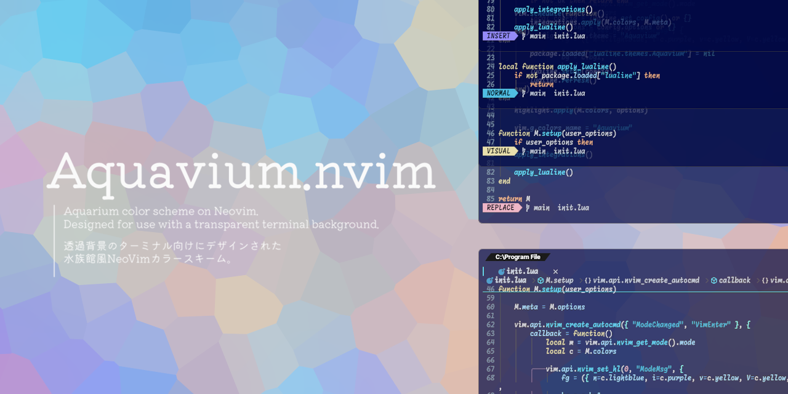
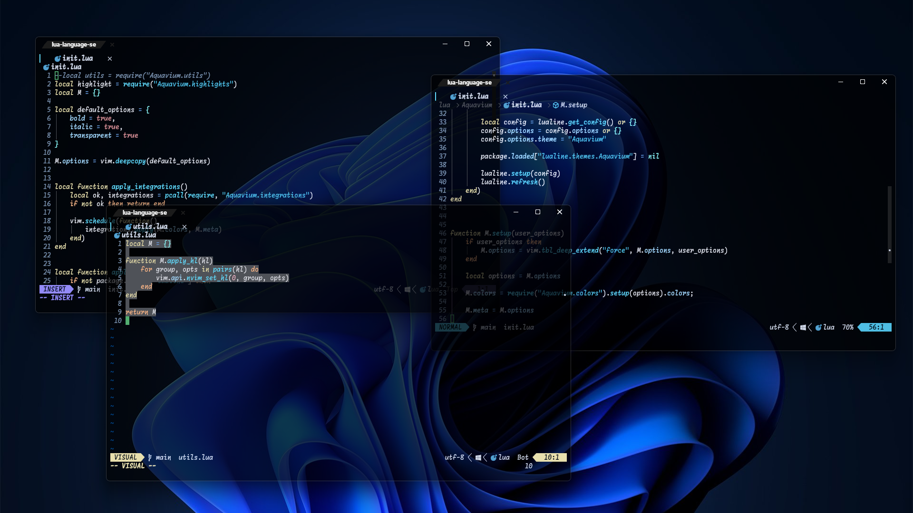
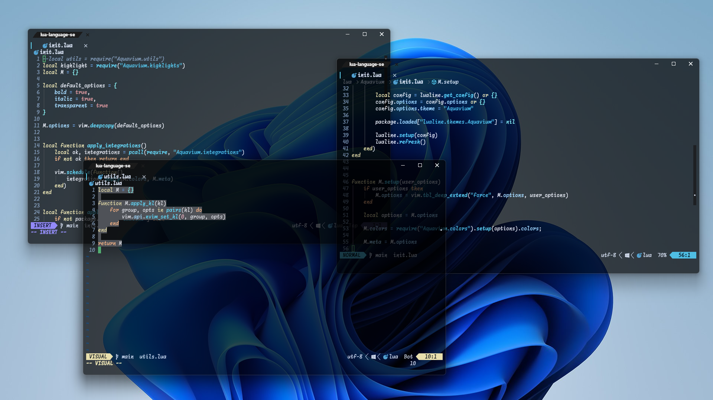
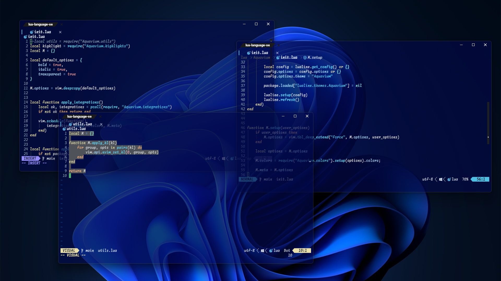

<div align="center">
    <h1>🪼 Aquavium.nvim 🦈</h1>
    <sub>Aquarium color scheme on Neovim</sub>
</div>

<br>

<div align="center">
    
</div>

<hr>

<div align="center">
    <!-- <picture> -->
    <!--     <source media="(prefers-color-scheme: dark)" srcset=""> -->
    <!--     <source media="(prefers-color-scheme: light)" srcset=""> -->
    <!--      -->
    <!-- </picture> -->
    <a href="https://neovim.io/">
        <picture>
            <source media="(prefers-color-scheme: dark)" srcset="https://img.shields.io/badge/%20Neovim-%2357a143?style=flat&logo=Neovim&logoColor=%2357a143&label=Built%20for&labelColor=%23444444&link=https%3A%2F%2Fneovim.io%2F">
            <source media="(prefers-color-scheme: light)" srcset="https://img.shields.io/badge/%20Neovim-%2357a143?style=flat&logo=Neovim&logoColor=%2357a143&label=Built%20for&labelColor=%23ffffff&link=https%3A%2F%2Fneovim.io%2F">
            
        </picture>
    </a>
    <a href="https://neovim.io/doc/install/">
        <picture>
            <source media="(prefers-color-scheme: dark)" srcset="https://img.shields.io/badge/%200.11+-%233791d4?style=flat&logo=Neovim&logoColor=%233791d4&label=Required&labelColor=%23444444&link=https%3A%2F%2Fneovim.io%2F">
            <source media="(prefers-color-scheme: light)" srcset="https://img.shields.io/badge/%200.11+-%233791d4?style=flat&logo=Neovim&logoColor=%233791d4&label=Required&labelColor=%23ffffff&link=https%3A%2F%2Fneovim.io%2F">
            
        </picture>
    </a>
    <br><br>
    <a href="./LICENSE">
        <picture>
            <source media="(prefers-color-scheme: dark)" srcset="https://img.shields.io/badge/%20MIT%20License%20-%23004584?style=flat&label=License&labelColor=%23444444&link=https%3A%2F%2Fneovim.io%2F">
            <source media="(prefers-color-scheme: light)" srcset="https://img.shields.io/badge/%20MIT%20License%20-%23004584?style=flat&label=License&labelColor=%23ffffff&link=https%3A%2F%2Fneovim.io%2F">
            
        </picture>
    </a>
    <a href="./NOTICE">
        <picture>
            <source media="(prefers-color-scheme: dark)" srcset="https://img.shields.io/badge/NOTICE%20-%2363deff?style=flat&label=Notice&labelColor=%23444444&link=https%3A%2F%2Fneovim.io%2F">
            <source media="(prefers-color-scheme: light)" srcset="https://img.shields.io/badge/NOTICE%20-%2363deff?style=flat&label=Notice&labelColor=%23ffffff&link=https%3A%2F%2Fneovim.io%2F">
            
        </picture>
    </a>
    <br><br>
    <picture>
        <source media="(prefers-color-scheme: dark)" srcset="https://img.shields.io/github/last-commit/T-b-t-nchos/Aquavium.nvim?display_timestamp=author&style=flat&logo=Github&color=%234fbee3&labelColor=%23444444">
        <source media="(prefers-color-scheme: light)" srcset="https://img.shields.io/github/last-commit/T-b-t-nchos/Aquavium.nvim?display_timestamp=author&style=flat&logo=Github&color=%234fbee3&labelColor=%23ffffff&logoColor=%23000">
        
    </picture>
    <picture>
        <source media="(prefers-color-scheme: dark)" srcset="https://img.shields.io/github/commit-activity/t/T-b-t-nchos/Aquavium.nvim?display_timestamp=author&style=flat&logo=Github&color=%23e8dfad&labelColor=%23444444">
        <source media="(prefers-color-scheme: light)" srcset="https://img.shields.io/github/commit-activity/t/T-b-t-nchos/Aquavium.nvim?display_timestamp=author&style=flat&logo=Github&color=%23e8dfad&labelColor=%23ffffff&logoColor=%23000">
        
    </picture>
    <picture>
        <source media="(prefers-color-scheme: dark)" srcset="https://img.shields.io/github/stars/T-b-t-nchos/Aquavium.nvim?display_timestamp=author&style=flat&logo=Github&color=%23938af8&labelColor=%23444444">
        <source media="(prefers-color-scheme: light)" srcset="https://img.shields.io/github/stars/T-b-t-nchos/Aquavium.nvim?display_timestamp=author&style=flat&logo=Github&color=%23938af8&labelColor=%23ffffff&logoColor=%23000">
        
    </picture>
    <picture>
        <source media="(prefers-color-scheme: dark)" srcset="https://img.shields.io/github/issues-search?query=repo%3AT-b-t-nchos%2FAquavium.nvim%20type:issue&style=flat&logo=GitHub&label=Total%20Issues&color=%23eeb6c7&labelColor=%23444444">
        <source media="(prefers-color-scheme: light)" srcset="https://img.shields.io/github/issues-search?query=repo%3AT-b-t-nchos%2FAquavium.nvim%20type:issue&style=flat&logo=GitHub&label=Total%20Issues&color=%23eeb6c7&labelColor=%23ffffff&logoColor=%23000">
        
    </picture>
    <picture>
        <source media="(prefers-color-scheme: dark)" srcset="https://img.shields.io/github/issues-search?query=repo%3AT-b-t-nchos%2FAquavium.nvim%20type:pr&style=flat&logo=GitHub&label=Total%20Pull%20Requests&color=%23da9197&labelColor=%23444444">
        <source media="(prefers-color-scheme: light)" srcset="https://img.shields.io/github/issues-search?query=repo%3AT-b-t-nchos%2FAquavium.nvim%20type:pr&style=flat&logo=GitHub&label=Total%20Pull%20Requests&color=%23da9197&labelColor=%23ffffff&logoColor=%23000">
        
    </picture>
</div>

<hr>

## ✨ 概要 - Overview -
<sub>"Aquavium" is designed for use with a transparent terminal background</sub>  
"Aquavium"はターミナルの背景を透過させることを前提とした、  
<sub>and features an aquarium-themed color scheme</sub>    
水族館をモチーフにしたカラーテーマです。  

## 📷️ プレビュー - Preview -

|TermColor|dark-wallpaper|light-wallpaper|
|---|---|---|
|black|||
|blue|||

## 💼 依存関係 - Dependencies -
- [Neovim](https://github.com/neovim/neovim) 0.11+
- [nvim-treesitter](https://github.com/nvim-treesitter/nvim-treesitter) (Optional)

## 🧩 対応しているプラグイン - Supported plugins -
- [bufferline.nvim](https://github.com/akinsho/bufferline.nvim)
- [dashboard-nvim](https://github.com/nvimdev/dashboard-nvim/)
- [lazy.nvim](https://github.com/folke/lazy.nvim)
- [lualine.nvim](https://github.com/nvim-lualine/lualine.nvim)
- [Markview.nvim](https://github.com/OXY2DEV/markview.nvim)
- [nvim-cmp](https://github.com/hrsh7th/nvim-cmp)
- [nvim-notify](https://github.com/rcarriga/nvim-notify)
- [nvim-treesitter-context](https://github.com/nvim-treesitter/nvim-treesitter-context)

<details>
<summary>有効化の方法 / How to apply</summary>
<details>
<summary>nvim-cmp</summary>
<pre lang="lua"><code>config = function()
    local cmp = require("cmp")
    cmp.setup({
        window = {
            completion = {
                winhighlight = "Normal:CmpNormal,FloatBorder:CmpBorder,CursorLine:CmpMenuSel",
            }
        },
    })
end,
</code></pre>
</details>
</details>
<sub>For plugins not listed in the "How to apply" section, no specific configuration is required.</sub><br>
有効化の方法について記載のないプラグインについては、特別な設定は不要です。

## 🔧 インストール - Install -
### In terminal
<sub>Please set opacity</sub>  
透明度を設定してください。  
  
> [!TIP]
> <sub>Recommend background: #000, transparent: 70%</sub>  
> 推奨 背景: #000, 不透明度: 70%  

例(example):
```lua
---- WezTerm Nightly
-- Set background color
config.window_background_gradient = {colors = {'#000000'}} -- or other color

-- Set opacity
config.window_background_opacity = 0.7

--config.window_background_opacity = opacity_state
--config.window_decorations = 'INTEGRATED_BUTTONS'
```
### In Neovim
#### **推奨設定/Recommended**
```lua
vim.opt.winborder = "rounded"
```
#### パッケージマネージャー/Package Manager
##### Lazy.nvim
```lua
{
    "T-b-t-nchos/Aquavium.nvim",
    lazy = false,
    priority = 1000,
    config = function()
        local aquavium = require("Aquavium")

        aquavium.setup({
            -- your options here
        })

        vim.cmd("colorscheme Aquavium")
    end,
},
```

## 🛠️ オプション - Options -
```lua
{
    bold = true,        -- enable/disable to use bold-style
    italic = true,      -- enable/disable to use italic-style
    transparent = true, -- enable/disable transparent background

    -- Add custom highlights
    -- You can use the colors and options in the function.
    -- Also, you can use the simpler table if you don't need the colors and options.
    custom_highlights = function(c, opts)
        return {
        }            
    end,
}
```

## 💡 インスピレーション元 - Source of inspire -

<sub>This color theme is inspired by [The Aquarium does not dance](https://daidai7742.wixsite.com/aqua-dance).</sub>  
本カラーテーマは[アクアリウムは踊らない](https://daidai7742.wixsite.com/aqua-dance)より、インスピレーションを受けました。  
<sub>For more details, please see [here](./doc/TADND.md).</sub>  
アクアリウムは踊らないについて、詳しくは[こちら](./doc/TADND.md)を御覧ください。  
<sub>(2026/02/15) Happy 2nd Anniversary!</sub>  
(2026/02/15) 二周年、おめでとうございます!
  
> [!WARNING]
> This work is a fan creation and has no affiliation with the official creators.  
> 本作品は、公式様とは一切の関わりを持たない、ファンによる作品です。 

> [!NOTE]
> This color scheme complies with [The Aquarium does not dance, Secondary Creation Guideline](https://daidai7742.wixsite.com/aqua-dance/guideline).  
> 本カラースキームは[アクアリウムは踊らない二次創作ガイドライン](https://daidai7742.wixsite.com/aqua-dance/guideline)に準拠しています。

## 🙏 お願い - Request to you -
> <sub>This is my first time developing a color scheme. So, there may be some issues.</sub>  
> このカラースキームは、私の初めてのカラースキーム開発です。そのため、不具合などがある可能性があります。  
> <sub>I'd love to take a look at your GitHub issue or PR if you find any issues.</sub>  
> 不具合などを見つけた場合は、Issue/PRの作成を、ぜひお願い致します。

> <sub>Also, I’d love to see any requests on GitHub issues.</sub>  
> また、GitHub issue 上でのリクエスト等もお待ちしています。

## 👥 貢献者 - Contributors -
<sub>See here:</sub>  
こちらをご覧ください:  **[🤝THANKS.md](./THANKS.md)**
