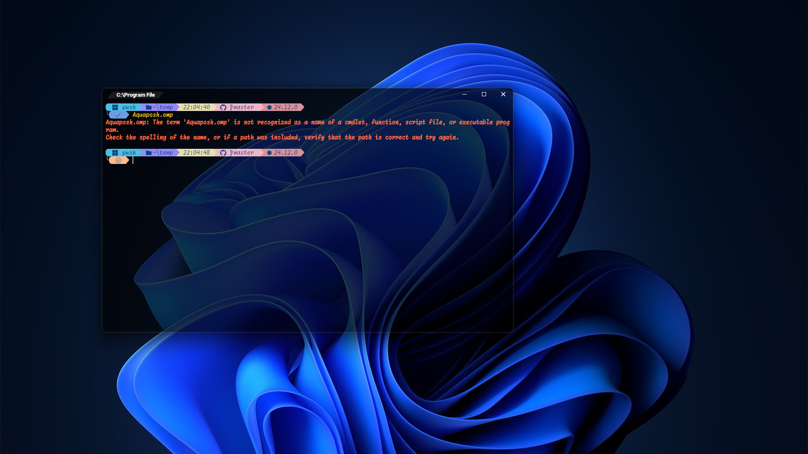
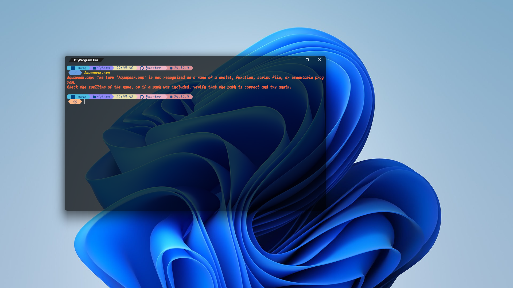
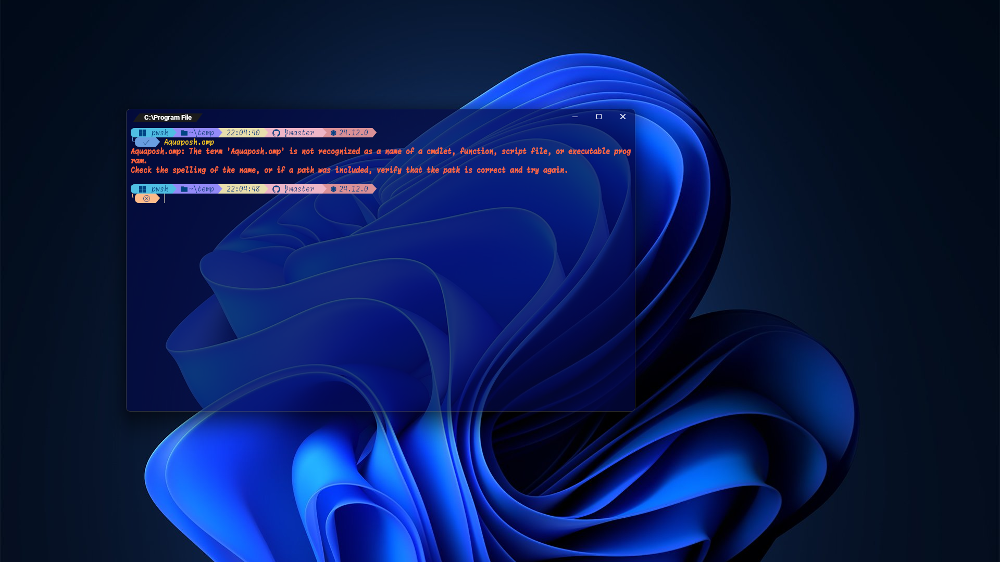
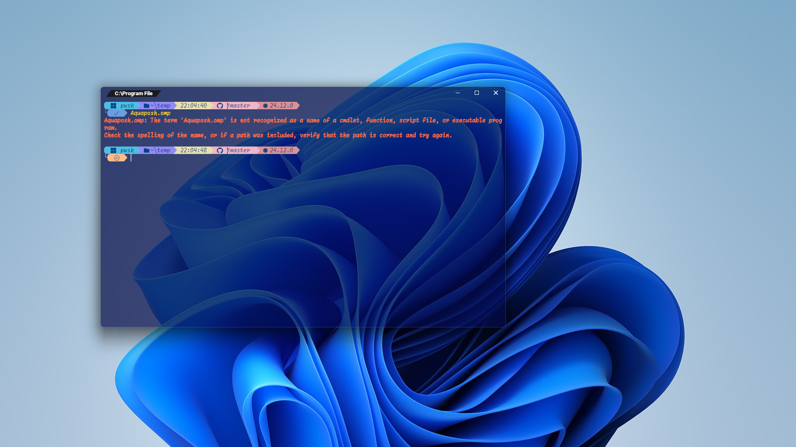

# Aquaposh.omp 🐚
##### Aquavium color scheme on Oh My Posh
<hr>


## ✨ 概要 - Overview -
<sub>Aquaposh.omp is a theme for Oh My Posh that </sub><br>
Aquaposh.ompは、NeovimのカラースキームであるAquavium.nvimを、  
<sub>uses the Aquavium color scheme</sub><br>
Oh My Poshのテーマとして使用するためのテーマです。  
<br>
<sub>Please see the README.md in the root directory for details about Aquavium.</sub><br>
Aquaviumについての詳細はルートディレクトリのREADME.mdを参照してください。  


## 📷️ プレビュー - Preview -

|TermColor|dark-wallpaper|light-wallpaper|
|---|---|---|
|black|||
|blue|||

<details>
<summary>WezTerm color config</summary>

```lua
local wezterm = require 'wezterm'

local config = wezterm.config_builder()

config.color_scheme = 'Custom Dimidium'
config.color_schemes = {
    -- Port of Dimidium (zlib license)
    -- Original: https://github.com/dofuuz/dimidium
    -- Modified by: T-b-t-nchos
    ['Custom Dimidium'] = {
        foreground = "#ccc",
        background = "#141414",

        cursor_bg = '#eee',
        cursor_fg = 'none',
        cursor_border = 'none',

        ansi = {
            "#000000", -- black
            "#cf494c", -- red
            "#60b442", -- green
            "#db9c11", -- yellow
            "#0575d8", -- blue
            "#af5ed2", -- magenta
            "#1db6bb", -- cyan
            "#bab7b6", -- white
        },

        brights = {
            "#817e7e", -- bright black
            "#ff643b", -- bright red
            "#37e57b", -- bright green
            "#fccd1a", -- bright yellow
            "#688dfd", -- bright blue
            "#ed6fe9", -- bright magenta
            "#32e0fb", -- bright cyan
            "#dee3e4", -- bright white
        },
    },
}
```

</details>

## 💼 依存関係 - Dependents -
- [Oh My Posh](https://github.com/JanDeDobbeleer/oh-my-posh)

## 🔧 インストール - Install -
<sub>Please refer to the official documentation.</sub><br>
oh-my-poshの公式ドキュメントを参照してください。<br>
> [https://ohmyposh.dev/docs/](https://ohmyposh.dev/docs/)
